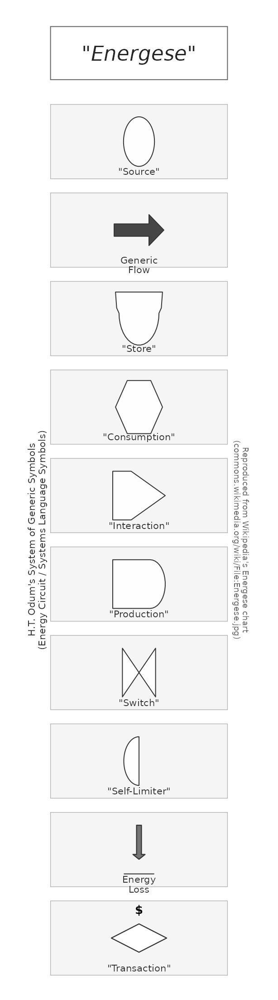
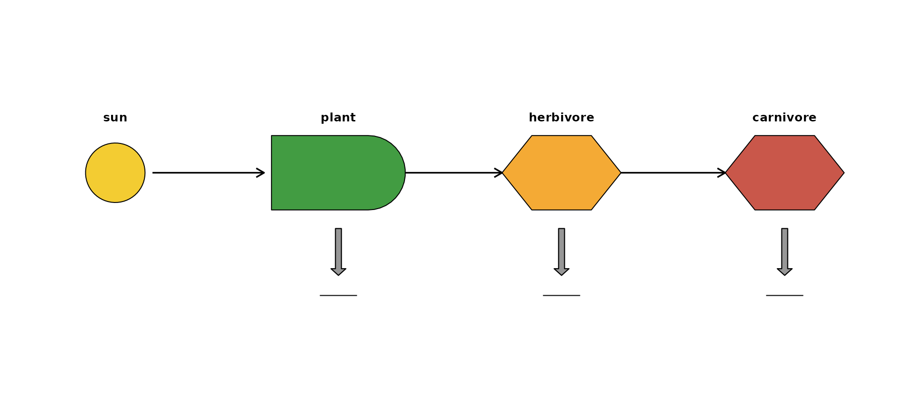
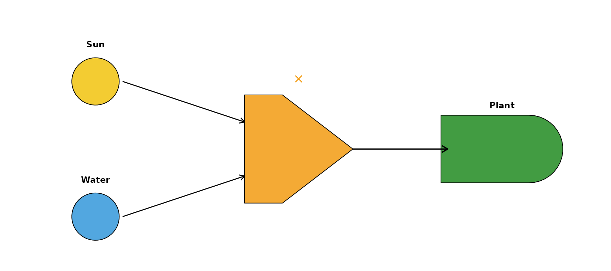
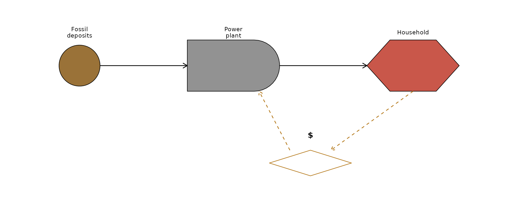

# Getting started with energese

**energese** provides `ggplot2` layers for H.T. Odum’s *Energy Systems
Language* (ESL) — also known as **Energese**, *Energy Circuit Language*,
or *Generic Systems Symbols*. Odum developed the language in the 1950s
during tropical-forest studies at El Verde, Puerto Rico (Odum & Pigeon
1970, funded by the U.S. Atomic Energy Commission) and formalised it in
later systems-ecology work. See the [Wikipedia
article](https://en.wikipedia.org/wiki/Energy_systems_language) for a
general introduction.

## The Wikipedia reference chart, reproduced

Wikipedia’s canonical [Energese reference
chart](https://commons.wikimedia.org/wiki/File:Energese.jpg) shows every
ESL symbol Odum used.
[`plot_energese_reference()`](https://pkg.energese.org/reference/plot_energese_reference.md)
renders the same chart directly from R:

``` r

library(energese)
plot_energese_reference()
#> Warning: Unknown or uninitialised column: `subgroup`.
#> Warning: Unknown or uninitialised column: `linetype`.
#> Warning: Unknown or uninitialised column: `subgroup`.
#> Warning: Unknown or uninitialised column: `linetype`.
#> Warning: Unknown or uninitialised column: `subgroup`.
#> Warning: Unknown or uninitialised column: `linetype`.
#> Warning: Unknown or uninitialised column: `subgroup`.
#> Warning: Unknown or uninitialised column: `linetype`.
#> Warning: Unknown or uninitialised column: `subgroup`.
#> Warning: Unknown or uninitialised column: `linetype`.
#> Warning: Unknown or uninitialised column: `subgroup`.
#> Warning: Unknown or uninitialised column: `linetype`.
#> Warning: Unknown or uninitialised column: `subgroup`.
#> Warning: Unknown or uninitialised column: `linetype`.
#> Warning: Unknown or uninitialised column: `subgroup`.
#> Warning: Unknown or uninitialised column: `linetype`.
#> Warning: Unknown or uninitialised column: `subgroup`.
#> Warning: Unknown or uninitialised column: `linetype`.
#> Unknown or uninitialised column: `linetype`.
#> Unknown or uninitialised column: `linetype`.
#> Warning: Unknown or uninitialised column: `subgroup`.
#> Warning: Unknown or uninitialised column: `linetype`.
```



## Symbol semantics

Each symbol has a specific meaning in Odum’s framework:

- **Source** (circle) — a renewable or external input to the system.
  Sun, wind, tide, hydrocarbon deposits, uranium.
- **Generic flow** (arrow) — energy flow between components.
- **Storage** (Bertalanffy module — flat top, rounded bottom) — a
  reservoir of matter, energy, or information. Named after Ludwig von
  Bertalanffy, the general-systems theorist.
- **Consumer** (hexagon) — an entity that uses stored emergy.
- **Interaction** (right-pointing chevron) — a multiplicative junction
  where two or more flows combine. Odum’s canonical shape is a chevron,
  not a diamond.
- **Producer** (rounded rectangle with pointed right, aka “bullet”) — an
  autocatalytic unit that captures and concentrates emergy. Plants,
  agriculture, power stations.
- **Switch** (bowtie) — an on/off logic gate.
- **Self-limiter** (semi-circle) — a producer/consumer whose output
  saturates.
- **Heat sink / Energy Loss** (down-arrow to ground) — dispersed heat at
  the end of a transformation. Every transformation eventually
  terminates in a heat sink per the second law.
- **Transaction** (elongated diamond with \$ label) — a money node,
  drawn with money flow going in the *opposite* direction of energy flow
  (dashed connecting lines).

## Composing a simple ecosystem diagram

Sun → producer (autotroph) → consumer (herbivore) → consumer
(carnivore), each with a heat-sink arrow to ground:

``` r

library(ggplot2)
library(energese)

nodes <- data.frame(
  x    = c(1,   4,     7,          10),
  y    = c(1.5, 1.5,   1.5,        1.5),
  role = c("sun", "plant", "herbivore", "carnivore"))

ggplot() +
  geom_odum_source  (data = nodes[1, ], aes(x = x, y = y),
                     radius = 0.4, fill = "#F1C40F") +
  geom_odum_producer(data = nodes[2, ], aes(x = x, y = y),
                     width = 1.8, height = 1.0, fill = "#228B22") +
  geom_odum_consumer(data = nodes[3, ], aes(x = x, y = y),
                     width = 1.6, height = 1.0, fill = "#F39C12") +
  geom_odum_consumer(data = nodes[4, ], aes(x = x, y = y),
                     width = 1.6, height = 1.0, fill = "#C0392B") +
  # Energy flows
  geom_segment(aes(x = 1.5, xend = 3.0, y = 1.5, yend = 1.5),
               arrow = arrow(length = unit(0.10, "in")),
               linewidth = 0.6) +
  geom_segment(aes(x = 4.9, xend = 6.2, y = 1.5, yend = 1.5),
               arrow = arrow(length = unit(0.10, "in")),
               linewidth = 0.6) +
  geom_segment(aes(x = 7.8, xend = 9.2, y = 1.5, yend = 1.5),
               arrow = arrow(length = unit(0.10, "in")),
               linewidth = 0.6) +
  # Heat sinks below each consumer
  geom_odum_heat_sink(data = nodes[2:4, ],
                     aes(x = x, y = y - 1.2),
                     width = 0.5, height = 0.9,
                     fill = "grey55") +
  # Labels
  geom_text(data = nodes,
            aes(x = x, y = y + 0.75, label = role),
            size = 3.4, fontface = "bold") +
  coord_fixed(xlim = c(0, 11), ylim = c(-0.8, 3)) +
  theme_void()
#> Warning: Unknown or uninitialised column: `subgroup`.
#> Warning: Unknown or uninitialised column: `linetype`.
#> Warning: Unknown or uninitialised column: `subgroup`.
#> Warning: Unknown or uninitialised column: `linetype`.
#> Warning: Unknown or uninitialised column: `subgroup`.
#> Warning: Unknown or uninitialised column: `linetype`.
#> Warning: Unknown or uninitialised column: `subgroup`.
#> Warning: Unknown or uninitialised column: `linetype`.
#> Warning: Unknown or uninitialised column: `subgroup`.
#> Warning: Unknown or uninitialised column: `linetype`.
#> Unknown or uninitialised column: `linetype`.
#> Unknown or uninitialised column: `linetype`.
#> Unknown or uninitialised column: `linetype`.
#> Unknown or uninitialised column: `linetype`.
```



## Interaction junction — the chevron in action

The interaction symbol (chevron) has two inputs on its flat left edge
and one output on its pointed right tip. Here a producer needs both
sunlight and water:

``` r

d <- data.frame(x = c(1, 1, 4, 7), y = c(2.5, 0.5, 1.5, 1.5))

ggplot() +
  geom_odum_source(data = d[1, ], aes(x = x, y = y),
                   radius = 0.35, fill = "#F1C40F") +
  geom_odum_source(data = d[2, ], aes(x = x, y = y),
                   radius = 0.35, fill = "#3498DB") +
  geom_odum_interaction(data = d[3, ], aes(x = x, y = y),
                        width = 1.6, height = 1.6,
                        fill = "#F39C12") +
  geom_odum_producer(data = d[4, ], aes(x = x, y = y),
                     width = 1.8, height = 1.0, fill = "#228B22") +
  # Two inputs → interaction
  geom_segment(aes(x = 1.4, xend = 3.2, y = 2.5, yend = 1.9),
               arrow = arrow(length = unit(0.08, "in"))) +
  geom_segment(aes(x = 1.4, xend = 3.2, y = 0.5, yend = 1.1),
               arrow = arrow(length = unit(0.08, "in"))) +
  # Interaction → producer
  geom_segment(aes(x = 4.8, xend = 6.2, y = 1.5, yend = 1.5),
               arrow = arrow(length = unit(0.10, "in")),
               linewidth = 0.6) +
  # Labels
  annotate("text", x = 1, y = 3.05, label = "Sun",   fontface = "bold", size = 3.2) +
  annotate("text", x = 1, y = 1.05, label = "Water", fontface = "bold", size = 3.2) +
  annotate("text", x = 4, y = 2.55, label = "×",     size = 5, colour = "#F39C12") +
  annotate("text", x = 7, y = 2.15, label = "Plant", fontface = "bold", size = 3.2) +
  coord_fixed(xlim = c(0, 8.2), ylim = c(0, 3.4)) +
  theme_void()
#> Warning: Unknown or uninitialised column: `subgroup`.
#> Warning: Unknown or uninitialised column: `linetype`.
#> Warning: Unknown or uninitialised column: `subgroup`.
#> Warning: Unknown or uninitialised column: `linetype`.
#> Warning: Unknown or uninitialised column: `subgroup`.
#> Warning: Unknown or uninitialised column: `linetype`.
#> Warning: Unknown or uninitialised column: `subgroup`.
#> Warning: Unknown or uninitialised column: `linetype`.
```



## A small economic system with money transaction

Fossil-fuel source → power plant → household consumer, with money
flowing back the other way as a dashed transaction:

``` r

n <- data.frame(x = c(1, 4, 7.5, 5.5), y = c(2.5, 2.5, 2.5, 0.6))

ggplot() +
  geom_odum_source(data = n[1, ], aes(x = x, y = y),
                   radius = 0.4, fill = "#8A5A16") +
  geom_odum_producer(data = n[2, ], aes(x = x, y = y),
                     width = 1.8, height = 1.0, fill = "#7F7F7F") +
  geom_odum_consumer(data = n[3, ], aes(x = x, y = y),
                     width = 1.8, height = 1.0, fill = "#C0392B") +
  geom_odum_transaction(data = n[4, ], aes(x = x, y = y),
                        width = 1.6, height = 0.5,
                        fill = "white", colour = "#B5791B") +
  # Energy flows (left to right)
  geom_segment(aes(x = 1.4, xend = 3.1, y = 2.5, yend = 2.5),
               arrow = arrow(length = unit(0.10, "in"))) +
  geom_segment(aes(x = 4.9, xend = 6.6, y = 2.5, yend = 2.5),
               arrow = arrow(length = unit(0.10, "in"))) +
  # Money flow (right to left, dashed) via the transaction node
  geom_segment(aes(x = 7.5, xend = 5.9, y = 2.0, yend = 0.85),
               arrow = arrow(length = unit(0.08, "in")),
               linetype = "dashed", colour = "#B5791B") +
  geom_segment(aes(x = 5.1, xend = 4.5, y = 0.85, yend = 2.0),
               arrow = arrow(length = unit(0.08, "in")),
               linetype = "dashed", colour = "#B5791B") +
  # $ label above transaction
  annotate("text", x = 5.5, y = 1.15, label = "$",
           fontface = "bold", size = 4) +
  annotate("text", x = 1, y = 3.15, label = "Fossil\ndeposits", size = 3, lineheight = 0.9) +
  annotate("text", x = 4, y = 3.15, label = "Power\nplant",     size = 3, lineheight = 0.9) +
  annotate("text", x = 7.5, y = 3.15, label = "Household",       size = 3) +
  coord_fixed(xlim = c(0, 8.8), ylim = c(0, 3.6)) +
  theme_void()
#> Warning: Unknown or uninitialised column: `subgroup`.
#> Warning: Unknown or uninitialised column: `linetype`.
#> Warning: Unknown or uninitialised column: `subgroup`.
#> Warning: Unknown or uninitialised column: `linetype`.
#> Warning: Unknown or uninitialised column: `subgroup`.
#> Warning: Unknown or uninitialised column: `linetype`.
#> Warning: Unknown or uninitialised column: `subgroup`.
#> Warning: Unknown or uninitialised column: `linetype`.
```



## Low-level helpers

If you need the polygon coordinates directly (for `gganimate`
`transition_*()`, patchwork composition, non-ggplot renderers), the
vertex-tibble helpers are also exported:

``` r

odum_storage(cx = 0, cy = 0, w = 1, h = 1, id = "s1")
#> # A tibble: 25 × 3
#>         x      y id   
#>     <dbl>  <dbl> <chr>
#>  1 -0.5    0.5   s1   
#>  2  0.5    0.5   s1   
#>  3  0.475  0.2   s1   
#>  4  0.425 -0.075 s1   
#>  5  0.419 -0.145 s1   
#>  6  0.402 -0.213 s1   
#>  7  0.374 -0.277 s1   
#>  8  0.335 -0.336 s1   
#>  9  0.288 -0.388 s1   
#> 10  0.232 -0.431 s1   
#> # ℹ 15 more rows
```

Each returns a tibble of `(x, y, id)` suitable for
[`geom_polygon()`](https://ggplot2.tidyverse.org/reference/geom_polygon.html).
The two multi-part symbols return their sub-shapes distinguished by
`id`:

``` r

head(odum_switch(cx = 0, cy = 0, w = 1, h = 1, id = "sw"), 4)
#> # A tibble: 4 × 3
#>       x     y id   
#>   <dbl> <dbl> <chr>
#> 1  -0.5   0.5 sw_L 
#> 2   0     0   sw_L 
#> 3  -0.5  -0.5 sw_L 
#> 4  -0.5   0.5 sw_L
```

## Prior art

To the author’s knowledge, `energese` is the first R (or Python)
grammar-of-graphics library for ESL. The closest peers are the
now-abandoned Java `EmSim` (Valyi & Ortega 2004, an ODE integrator with
no rendering API), the TypeScript GUI editor
[sholtomaud/odum-energy-language](https://github.com/sholtomaud/odum-energy-language)
by Sholto Maud (who also produced the Visio stencil that Wikipedia’s
reference chart is based on), and static SVG references from the [UF
Center for Environmental
Policy](https://cep.ees.ufl.edu/emergy/resources/symbols_diagrams.shtml).

## References

- Odum, H.T. & Pigeon, R.F. (eds.) (1970). *A Tropical Rain Forest: A
  Study of Irradiation and Ecology at El Verde, Puerto Rico*. U.S.
  Atomic Energy Commission.
- Odum, H.T. (1994). *Ecological and General Systems: An Introduction to
  Systems Ecology*. Rev. ed. University Press of Colorado.
- Odum, H.T. & Odum, E.C. (2000). *Modeling for All Scales: An
  Introduction to System Simulation*. Academic Press.
- Odum, H.T. (2007). *Environment, Power, and Society for the
  Twenty-First Century: The Hierarchy of Energy*. Columbia University
  Press.
- Brown, M.T. (2004). “A picture is worth a thousand words: Energy
  systems language and simulation.” *Ecological Modelling* 178: 83–100.
  <https://doi.org/10.1016/j.ecolmodel.2003.12.008>
