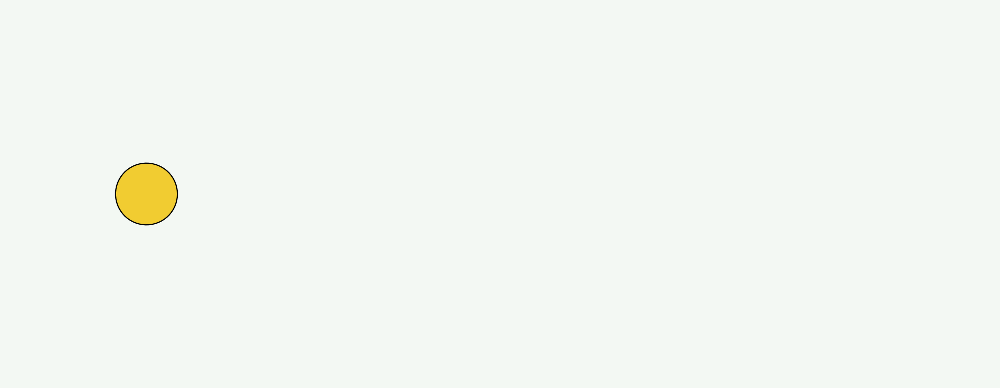
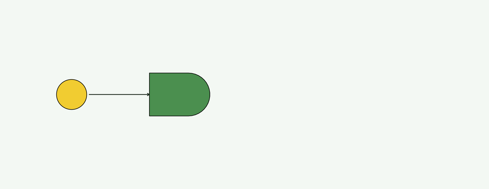
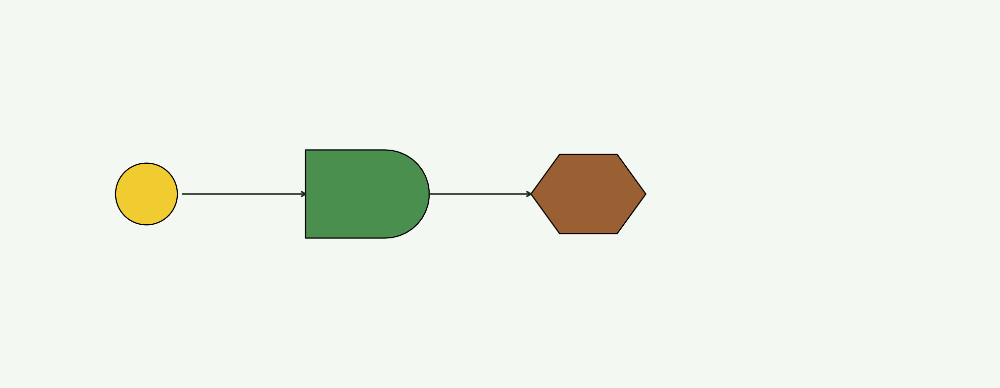
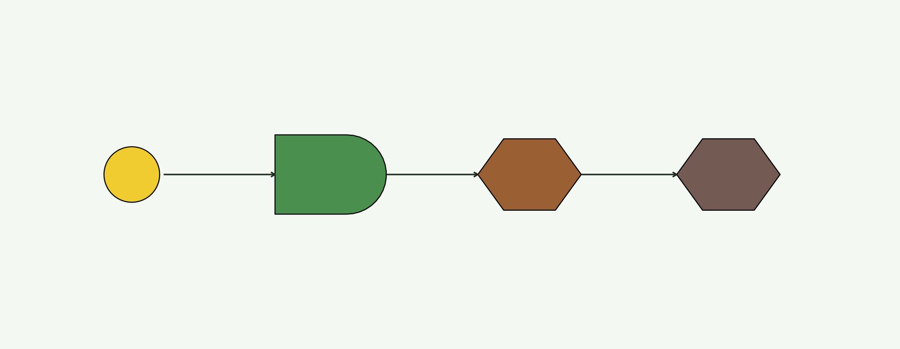
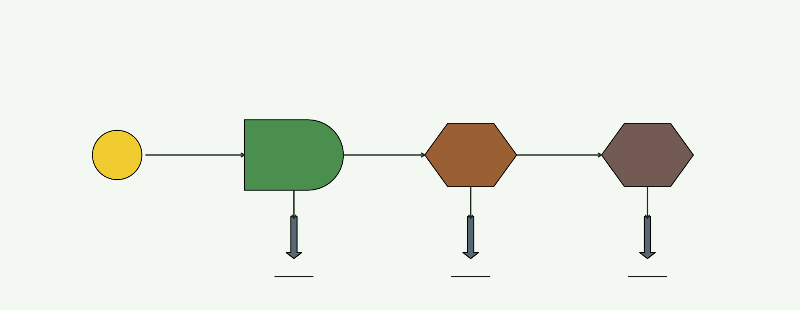
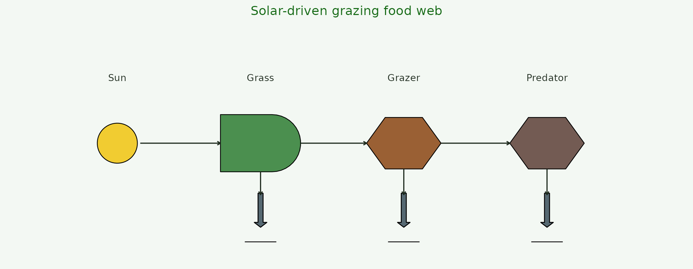

# Step-by-step: building a food web one geom at a time

This vignette watches a food web assemble one `geom_odum_*` layer at a
time. Same data, six versions of the plot — each step adds one symbol.
Copy the final block, tweak the data, and you have your own diagram.

``` r

library(ggplot2)
library(energese)

nodes <- data.frame(
  x    = c(1, 3.5, 6, 8.5),
  y    = 2,
  role = c("Sun", "Grass", "Grazer", "Predator"))

ink <- "#1d2a1d"
```

## 1. An empty canvas

Start with
[`ggplot()`](https://ggplot2.tidyverse.org/reference/ggplot.html) on the
node data,
[`coord_fixed()`](https://ggplot2.tidyverse.org/reference/coord_fixed.html)
for equal-scale drawing, and
[`theme_void()`](https://ggplot2.tidyverse.org/reference/ggtheme.html)
for a clean background.

``` r

base <- ggplot(nodes, aes(x, y)) +
  coord_fixed(xlim = c(0, 10), ylim = c(0, 4)) +
  theme_void()
base
```


## 2. Add the sun (source)

[`geom_odum_source()`](https://energese.org/reference/geom_odum.md) — a
filled circle. `radius` controls the size.

``` r

p2 <- base +
  geom_odum_source(data = nodes[1, ], radius = 0.35, fill = "#F1C40F")
p2
```



## 3. Add the primary producer (grass)

[`geom_odum_producer()`](https://energese.org/reference/geom_odum.md) —
the Odum “bullet” shape. Autocatalytic units that capture and
concentrate emergy.

``` r

p3 <- p2 +
  geom_odum_producer(data = nodes[2, ], width = 1.4, height = 1.0,
                      fill = "#2E7D32")
p3
```


## 4. Draw the sun→grass flow

Arrows between symbols are just `annotate("segment", ...)` calls with an
[`arrow()`](https://rdrr.io/r/grid/arrow.html) argument — no special
geom needed.

``` r

p4 <- p3 +
  annotate("segment", x = 1.4, xend = 2.8, y = 2, yend = 2,
           arrow = arrow(length = unit(0.12, "cm")), colour = ink)
p4
```



## 5. Add the grazer and its flow

Grazers are
[`geom_odum_consumer()`](https://energese.org/reference/geom_odum.md) (a
hexagon). Then draw the grass→grazer arrow.

``` r

p5 <- p4 +
  geom_odum_consumer(data = nodes[3, ], width = 1.3, height = 0.9,
                      fill = "#8B4513") +
  annotate("segment", x = 4.2, xend = 5.35, y = 2, yend = 2,
           arrow = arrow(length = unit(0.12, "cm")), colour = ink)
p5
```



## 6. Add the top predator + its flow

Same geom family, different fill. Grazer→predator arrow closes the
chain.

``` r

p6 <- p5 +
  geom_odum_consumer(data = nodes[4, ], width = 1.3, height = 0.9,
                      fill = "#5D4037") +
  annotate("segment", x = 6.65, xend = 7.85, y = 2, yend = 2,
           arrow = arrow(length = unit(0.12, "cm")), colour = ink)
p6
```



## 7. Second-law bookkeeping: heat sinks

Every transformation dissipates heat. Add one
[`geom_odum_heat_sink()`](https://energese.org/reference/geom_odum.md)
under each consumer.

``` r

sinks <- data.frame(x = c(3.5, 6, 8.5), y = 0.7)

p7 <- p6 +
  geom_odum_heat_sink(data = sinks, width = 0.55, height = 0.85,
                       fill = "#455a64") +
  annotate("segment", x = 3.5, xend = 3.5, y = 1.5, yend = 1.1,
           arrow = arrow(length = unit(0.12, "cm")), colour = ink) +
  annotate("segment", x = 6, xend = 6, y = 1.55, yend = 1.1,
           arrow = arrow(length = unit(0.12, "cm")), colour = ink) +
  annotate("segment", x = 8.5, xend = 8.5, y = 1.55, yend = 1.1,
           arrow = arrow(length = unit(0.12, "cm")), colour = ink)
p7
```



## 8. Labels + final polish

Label each node, tighten the frame, add a title. Now it’s a diagram.

``` r

p8 <- p7 +
  geom_text(aes(y = 3.15, label = role), size = 3.2, colour = ink) +
  labs(title = "Solar-driven grazing food web") +
  theme(plot.title = element_text(hjust = 0.5, size = 12, colour = "#176b17"))
p8
```



## What just happened

Every ESL diagram is the same recipe: an `x/y` node table, one
`geom_odum_*` per node kind, `annotate("segment", ...)` for the flows,
[`geom_odum_heat_sink()`](https://energese.org/reference/geom_odum.md)
under every transformation, labels via
[`geom_text()`](https://ggplot2.tidyverse.org/reference/geom_text.html).
That’s the entire grammar. See the case-studies vignette
([`vignette("case-studies", package = "energese")`](https://energese.org/articles/case-studies.md))
for four worked classical Odum systems built on this same recipe.
